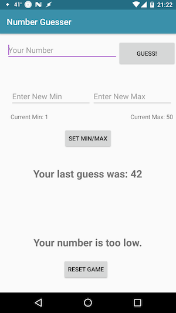

Number Guesser in Java

This is a rebuild of my old [Number Guesser](https://github.com/gness1804/number-guesser) project in Java using Android Studio. This app contains all of the functionality of the original: the user guesses a number within a stated range, and the computer chooses a separate number. If the two match, the user wins and the computer chooses a different number; otherwise, the app clues the user as to whether their number was too high or too low, and the game continues. The user can also set their own min and max range (default is 1 to 50), and reset the game to its original state.

This project was built in Java using Android Studio. 
